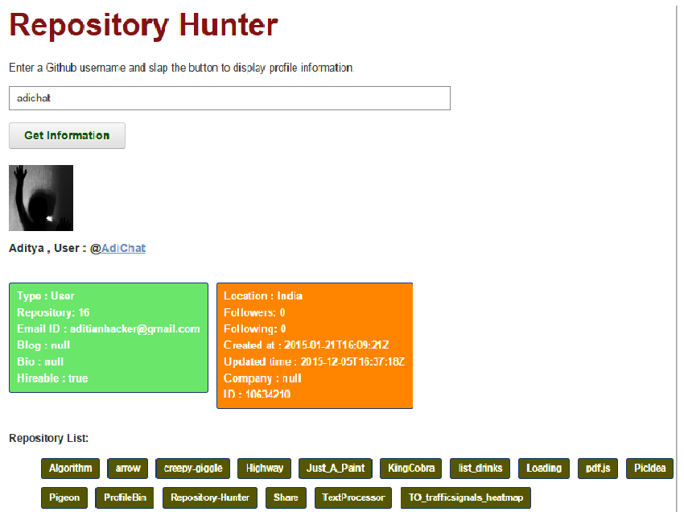

# Repository-Hunter
This is an application that is build upon the [GitHub API](https://developer.github.com/v3/). It is used to gain public information regarding a particular github account. 
The user has to enter the username of a GitHub account and this application will present all the available information. One will also be able to navigate to the user profile by clicking on the username and can also go to a particular repository of the user by clicking on the repository name. 
Use the app [here](http://repository-hunter.herokuapp.com/) 
This application comes in handy when the user is concerned about the actual information and particular repositories. 
This is a preview of the application : 
 
